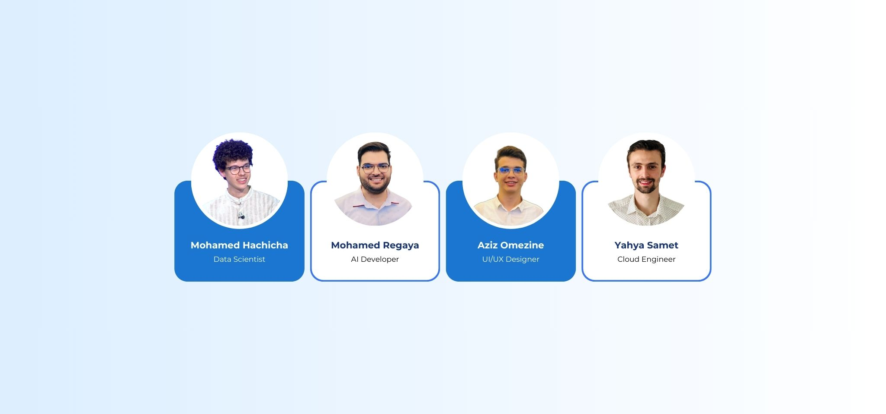

<h1 align="center">🌟 HealthPath 🌟</h1>

<p align="center">
  HealthPath is an innovative web application designed to empower diabetes patients by simplifying their health management journey. With features like a 3D assistant, personalized chatbot, glucose level tracking, and much more, HealthPath offers a comprehensive solution for diabetes care.
</p>



<h2>🗂️ Table of Contents</h2>
<ul>
  <li><a href="#features">💡 Features</a></li>
  <li><a href="#how-github-copilot-enhanced-development">🔧 How GitHub Copilot Enhanced Development</a></li>
  <li><a href="#team">👥 Team</a></li>
  <li><a href="#installation">⚙️ Installation</a></li>
  <li><a href="#usage">🚀 Usage</a></li>
  <li><a href="#contributing">🤝 Contributing</a></li>
  <li><a href="#license">🔒 License</a></li>
  <li><a href="#acknowledgments">📣 Acknowledgments</a></li>
  <li><a href="#environment-variables">🌐 Environment Variables</a></li>
  <li><a href="#technologies-used">🛠️ Technologies Used</a></li>
  <li><a href="#contact">📞 Contact</a></li>
</ul>

<h2 id="features">💡 Features</h2>

### 1. **3D Avatar Assistant**
   - Provides real-time support and guidance to users.
   - Answers questions related to diabetes management and glucose levels.

### 2. **Personalized Chatbot**
   - Allows users to upload meal photos and get instant feedback on whether the meal is safe for their condition.
   - Suggests insulin dosage based on the formula:
     ```
     CHO Insulin Dose = (Total grams of CHO in meal) / (Grams of CHO disposed by 1 unit of insulin)
     ```
   - Offers general health tips and answers to user inquiries.

### 3. **Glucose Level Tracking**
   - Tracks glucose levels in real time using Continuous Glucose Monitoring (CGM) integration.
   - Displays glucose trends by day or hour for better visualization.

### 4. **Glucose Management Report**
   - Generates a detailed report with:
     - Overview of glucose control.
     - Key patterns and trends.
     - Recommendations for improved management.

### 5. **Appointment Scheduling**
   - Includes a calendar feature to book and manage appointments for diabetes care.

### 6. **Diabetes Care Blogs**
   - Provides curated articles on the latest developments in diabetes management.

### 7. **Proactive Alerts**
   - Notifies users about glucose trends and recommended actions to stay ahead of potential issues.

<h2 id="how-github-copilot-enhanced-development">🔧 How GitHub Copilot Enhanced Development</h2>

Developing HealthPath during a hackathon posed challenges like tight deadlines and complex functionalities. GitHub Copilot proved to be an invaluable tool by:

- **Streamlining Coding:** Reduced the time spent on repetitive tasks and boilerplate code.
- **Accelerating Debugging:** Suggested optimized solutions and highlighted potential errors.
- **Enhancing Productivity:** Allowed the team to focus on innovating and refining user experience.

<h2 id="team">👥 Team</h2>


<h2 id="installation">⚙️ Installation</h2>

Follow these steps to set up the project locally:

1. **Clone the repository:**
   ```bash
   git clone https://github.com/HamaRegaya/HealthPath-Assistant.git
   ```

2. **Navigate to the project directory:**
   ```bash
   cd HealthPath-Assistant
   ```

3. **Install dependencies:**
   ```bash
   pip install -r requirements.txt  # For back-end
   ```
4. **Create a `.env` from `.env-example` file in the project directory with the following contents:**
5. **Start the development server:**
   ```bash
   python app.py  # Back-end
   ```

6. **Access the app:**
   Open your browser and navigate to `http://localhost:5000`.

<h2 id="usage">🚀 Usage</h2>

1. Sign up or log in to access the app.
2. Explore features like:
   - Interacting with the 3D assistant.
   - Uploading meal photos for chatbot analysis.
   - Tracking glucose levels through the dashboard.
   - Generating glucose management reports.
   - Managing appointments via the calendar.

<h2 id="contributing">🤝 Contributing</h2>

We welcome contributions to HealthPath! Here’s how you can help:

1. Fork the repository.
2. Create a new branch:
   ```bash
   git checkout -b feature-name
   ```
3. Commit your changes:
   ```bash
   git commit -m "Add your message here"
   ```
4. Push to your branch:
   ```bash
   git push origin feature-name
   ```
5. Submit a pull request.

<h2 id="license">🔒 License</h2>

This project is licensed under the MIT License. See the LICENSE file for details.

<h2 id="acknowledgments">📣 Acknowledgments</h2>

HealthPath was built with the collaboration of an incredible team during Accelerate App Development with GitHub Copilot. Special thanks to GitHub Copilot for enhancing our productivity and innovation during development.

<h2 id="environment-variables">🌐 Environment Variables</h2>

To run this project, you will need to add the following environment variables to your .env file:

- `AZURE_SPEECH_REGION`: Azure Speech service region.
- `AZURE_SPEECH_API_KEY`: Azure Speech service API key.
- `AZURE_ENDPOINT`: Azure OpenAI endpoint.
- `AZURE_OPENAI_API`: Azure OpenAI API key.
- `AZURE_OPENAI_DEPLOYMENT_NAME`: Azure OpenAI deployment name.
- `AZURE_OPENAI_VERSION`: Azure OpenAI version.
- `AZURE_OPENAI_API_KEY`: Azure OpenAI API key.
- `AZURE_OPENAI_ENDPOINT`: Azure OpenAI endpoint.
- `AZURE_OPENAI_API_VERSION`: Azure OpenAI API version.
- `AZURE_OPENAI_CHAT_DEPLOYMENT_NAME`: Azure OpenAI chat deployment name.
- `STT_LOCALES`: Speech-to-Text locales.
- `TTS_VOICE`: Text-to-Speech voice.
- `AVATAR_CHARACTER`: Avatar character configuration.
- `AVATAR_STYLE`: Avatar style configuration.
- `MONGO_URI`: MongoDB URI.
- `SECRET_KEY`: Secret key for Flask application.

<h2 id="technologies-used">🛠️ Technologies Used</h2>

- **Flask**: A micro web framework for Python.
- **MongoDB**: A NoSQL database for storing user data and conversations.
- **Azure OpenAI**: For natural language processing and chatbot functionalities.
- **Azure Speech**: For speech-to-text and text-to-speech capabilities.
- **Langchain**: For managing conversation chains and memory.
- **Pillow**: For image processing.
- **Bootstrap**: For responsive front-end design.
- **jQuery**: For DOM manipulation and AJAX requests.

<h2 id="contact">📞 Contact</h2>

For support or inquiries, please contact us at:
- **Email**: support@healthpath.com
- **Phone**: +1 (123) 456-7890
